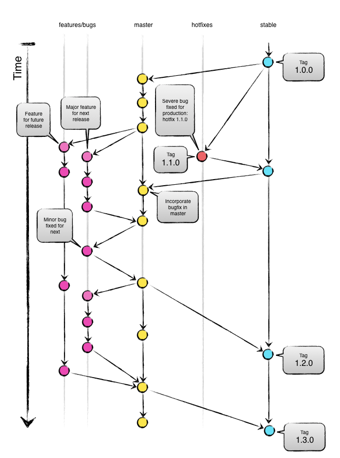

# Branching

## Quick Legend

| Instance | Branch        | Base Branch | Description    |
| :-------------|:-------------|:------------|:---------------|
| Stable | `stable` | `master` | A  release branch that follows the **semver** versioning. <br/>A pull request is required to merge code into `stable`. |
| Working      | `master`      | N/A         | The latest state of development (**unstable**). <br/>A pull request is required to merge code into `master`. |
| Features | `f_*`      | `master`         | Cutting-edge features (**unstable**). <br/>These branches are used for any maintenance features / active development|
| Hotfix | `h_*`      | `stable`         | Patch/Fix for something that is already released into **production**, that needs to go out right away|

## Main Branches

The main branch should be considered `origin/master` and will be the main branch where the source code of `HEAD` always reflects a state with the latest delivered development changes for the next release. As a developer, you will be branching and merging from `master`.

Consider `origin/stable` to always represent the latest code deployed to production. During day to day development, the `stable` branch will not be interacted with.

When the source code in the `master` branch is stable and has been deployed, all of the changes will be merged into `stable` and tagged with a release number. *How this is done in detail will be discussed later.*

## Supporting Branches

Supporting branches are used to aid parallel development between team members, ease tracking of features, and to assist in quickly fixing live production problems. Unlike the main branches, these branches always have a limited life time, since they will be removed eventually.

The different types of branches we may use are:

* Feature branches
* Bug branches
* Hotfix branches

Each of these branches have a specific purpose and are bound to strict rules as to which branches may be their originating branch and which branches must be their merge targets. Each branch and its usage is explained below.

### Feature Branches

Feature branches are used when developing a new feature or enhancement which has the potential of a development lifespan longer than a single deployment. When starting development, the deployment in which this feature will be released may not be known. No matter when the feature branch will be finished, it will always be merged back into the master branch.

During the lifespan of the feature development, the developer should watch the `master` branch to see if there have been commits since the feature was branched. Any and all changes to `master` should be **rebased** into the feature before merging back to `master`; this can be done at various times during the project or at the end, but time to handle merge conflicts should be accounted for.

`<tbd number>` represents the Jira project to which Project Management will be tracked.

* Must branch from: `master`
* Must merge back into: `master`
* Branch naming convention: `f-<tbd number>`

#### Working with a feature branch

If the branch does not exist yet, create the branch locally and then push to BitBucket. A feature branch should always be 'publicly' available. That is, development should never exist in just one developer's locally hosted branch.

```
$ git checkout -b feature-id master   // creates a local branch for the new feature from the master branch
$ git push -u origin feature-id       // makes the new feature remotely available
```

Periodically, changes made to `master` (if any) should be merged back into your feature branch.

```
$ git pull --rebase --autostash    // stash uncommitted changes, then pull the remote updates, and pop your stash to continue your work
$ git rebase master                // rebases changes from master into feature branch
```

When development on the feature is complete, a Pull Request (PR) should be submitted to the `master` branch. 

Once reviewed and approved the feature should merged into the `master` branch and the feature branch should be deleted.

### Hotfix Branches

A hotfix branch comes from the need to act immediately upon an undesired state of a live production version. Additionally, because of the urgency, a hotfix is not required to be be pushed during a scheduled deployment. Due to these requirements, a hotfix branch is always branched from a tagged `stable` branch. This is done for two reasons:

* Development on the `master` branch can continue while the hotfix is being addressed.
* A tagged `stable` branch still represents what is in production. At the point in time where a hotfix is needed, there could have been multiple commits to `master` which would then no longer represent production.

`<tdb number>` represents the Jira project to which Project Management will be tracked. 

* Must branch from: tagged `stable`
* Must merge back into: `master` and `stable`
* Branch naming convention: `h-<tbd number>`

#### Working with a hotfix branch

If the branch does not exist yet create the branch locally and then push to BitBucket. A hotfix branch should always be 'publicly' available. That is, development should never exist in just one developer's locally hosted branch.

```
$ git checkout -b hotfix-id stabe   // creates a local branch for the new feature from the stabe branch
$ git push -u origin hotfix-id       // makes the new feature remotely available
```

When development on the hotfix is complete, a Pull Request (PR) should be submitted to the `stable` branch. 

Once reviewed and approved the hotfix should be tagged and merged into the `stable` branch. The `stable` branch should then be merged into the `master` branch to not loose the hotfix and the hotfix branch should be deleted.

## Workflow Diagram
